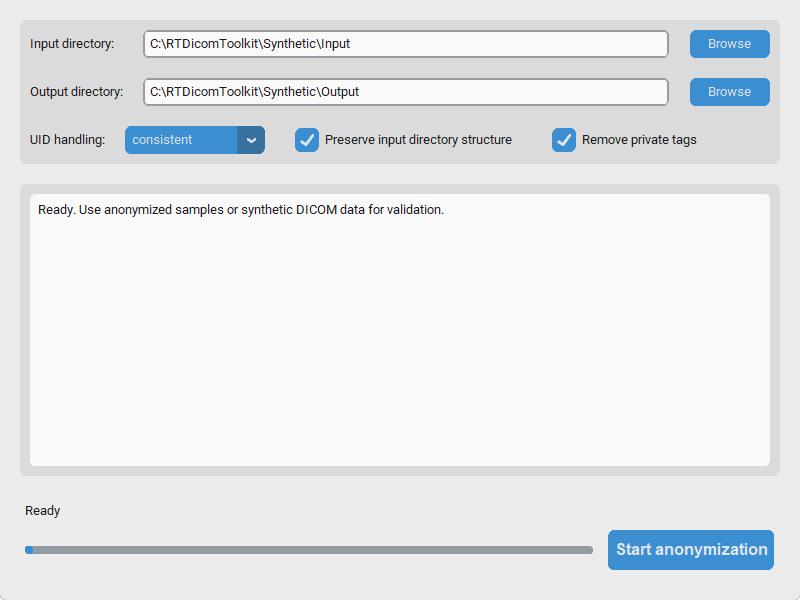

# Radiotherapy DICOM Anonymization and Validation Toolkit

A toolkit for anonymizing and validating radiotherapy (RT) DICOM files. It
supports privacy-conscious research and multi-institutional data-sharing
workflows, but its output alone does not guarantee complete de-identification,
legal compliance, or clinical suitability.

## Features



### Anonymizer

- **Modern GUI:** A CustomTkinter interface with dark-mode support.
- **Full and partial profiles:** Select an anonymization level appropriate to the
  workflow.
- **Consistent relationships:** Preserve Study/Series relationships while
  replacing UIDs consistently, or generate new UIDs.
- **Private-tag handling:** Recursively remove private tags, including tags in
  nested sequences.
- **Robust output:** Add standard file-meta information when saving non-standard
  DICOM input.

### Validator

- Compare DICOM tags before and after anonymization.
- Detect potentially remaining protected health information (PHI).
- Check that expected structural information is preserved.
- Generate detailed JSON and text validation reports.

## Quick start

### Launch the GUI

After completing the [development installation](#development-installation),
double-click `start_gui.bat` from the repository root. The launcher uses only
`.venv\Scripts\python.exe` and prints setup instructions instead of falling back
to an unconfigured system Python.

You can also run the same environment directly:

```powershell
.\.venv\Scripts\python.exe -m rt_dicom_toolkit
```

### Use the command line

```powershell
# Anonymize a directory
python -m rt_dicom_toolkit --input ./DICOM --output ./OUT --private remove

# Validate anonymized output against the original directory
python -m rt_dicom_toolkit validate --original ./DICOM --anonymized ./OUT
```

Use only synthetic data for development and testing. Never commit real-patient
DICOM, anonymized derivatives, reports, logs, or screenshots.

## Project structure

```text
rt-dicom-toolkit/
|-- rt_dicom_toolkit/
|   |-- anonymizer/        # Anonymization core
|   |-- gui/               # Desktop interfaces
|   |-- template/          # DICOM template synchronization
|   `-- validator/         # Validation and reports
|-- tests/                 # Pytest suite using synthetic data
|-- changes/               # OpenSpec change management
|-- docs/                  # Manuals and installation guides
|-- tools/                 # Offline and validation utilities
|-- AGENTS.md              # AI contributor entry point
`-- AI_AGENT_RULES.md       # AI development and safety policy
```

## Installation

### Requirements

- Python 3.10 or later
- Windows 10/11 is the primary desktop target

### Development installation

Virtual environments are intentionally not stored in Git. After a fresh clone
on Windows, create one and install the project into it:

```powershell
python -m venv .venv
.\.venv\Scripts\python.exe -m pip install --upgrade pip setuptools wheel
.\.venv\Scripts\python.exe -m pip install -r .\rt_dicom_toolkit\requirements.txt
.\.venv\Scripts\python.exe -m pip install -e .
```

Confirm that `python --version` selects a supported Python 3.10 or later before
creating the environment. Recreate `.venv` when changing to a different Python
installation.

### Offline installation on Windows

The offline bundle is self-contained and does not require administrator access
for a normal installation.

1. On an internet-connected computer, download
   `rt-dicom-toolkit-offline-win64-<version>.zip` from
   [GitHub Releases](https://github.com/inata169/rt-dicom-toolkit/releases).
2. Verify the ZIP's SHA-256 value against the checksum in its release notes.
3. Copy the ZIP to the offline Windows 10/11 x64 computer.
4. Extract it to a writable local folder. Do not run the installer directly
   from the ZIP or extract and install it on USB media.
5. Double-click `install_offline.bat`. It verifies the bundled files, creates a
   dedicated `.venv`, installs only from the bundled wheels, and runs a
   synthetic-DICOM smoke test.

To start the installed toolkit, double-click
`start_rt_dicom_toolkit.bat` in the extracted folder. Keep that folder in
place while using the application. Its `data` directory contains the default
input, output, log, and report locations.

To uninstall the offline toolkit:

1. Close every RT DICOM Toolkit window.
2. Move any files that must be retained out of the extracted `data` directory.
3. Check whether `.runtime\python.exe` exists in the extracted folder. If it
   does, open **Windows Settings > Apps > Apps & features** on Windows 10 or
   **Windows Settings > Apps > Installed apps** on Windows 11, then uninstall
   the **Python 3.12.10 (64-bit)** entry that was installed with this bundle. Do
   not remove an existing Python installation when the bundle has no `.runtime`.
4. Delete only the verified extracted bundle folder. This removes the toolkit,
   its dedicated virtual environment, and the remaining bundled files.

The installer does not add the toolkit to `PATH`, create shortcuts, or register
file associations. Output directories selected outside the extracted bundle,
such as a user-selected external output directory, are not removed during
uninstallation.

For checksum commands, reinstall instructions, troubleshooting, and the full
offline procedure, see the
[Windows offline installation guide](docs/windows_offline_installation.md).

## Testing

```powershell
python -m pytest -q -p no:cacheprovider tests
python tools/offline_smoke_test.py
```

The smoke test creates synthetic DICOM at runtime and removes it afterward.

## Development process

This project uses AI-assisted development within explicit safety and review
boundaries:

- Read [`AGENTS.md`](AGENTS.md) and [`AI_AGENT_RULES.md`](AI_AGENT_RULES.md)
  before making changes.
- Manage new capabilities and public-behavior changes through OpenSpec files in
  `changes/`.
- Work in small, single-purpose pull requests.
- A human reviews and merges pull requests; AI agents do not merge them.

## License

This project is available under the [MIT License](LICENSE).
