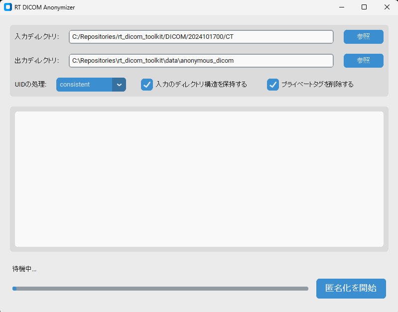

# 放射線治療DICOM匿名化・検証ツールキット

放射線治療（RT）用DICOMファイルの匿名化と検証を行うための包括的なツールキットです。本ツールは医学研究や多施設共同研究でのデータ共有において、患者のプライバシーを保護しつつ、放射線治療計画データを適切に扱うことを支援します。

## 特徴



### 匿名化ツール
- **モダンなGUI**: `customtkinter` を採用した直感的でダークモード対応のユーザーインターフェース。
- **完全・部分匿名化**: 用途に合わせた匿名化レベルの選択が可能。
- **一貫性の保持**: UIDの一貫性維持（同一Study/Seriesの関連性保持）や、シーケンシャルな匿名ID生成。
- **プライベートタグ処理**: ネストされたシーケンス内を含めたプライベートタグの再帰的削除。
- **堅牢な保存**: 非標準的なDICOMファイルでも標準的なヘッダーを付与して保存。

### 検証ツール
- 匿名化前後でのタグ比較と残留個人情報（PHI）の検出。
- 構造情報の保持確認。
- 詳細な検証レポート（JSON/TXT）の生成。

## クイックスタート

### 1. GUIで起動（推奨）
プロジェクト直下の `start_gui.bat` をダブルクリックするか、以下のコマンドを実行してください：
```powershell
python -m rt_dicom_toolkit
```

### 2. コマンドライン（CLI）で実行
引数を指定することで、従来通りのCLIモードで動作します：
```powershell
# 匿名化
python -m rt_dicom_toolkit --input ./DICOM --output ./OUT --private remove

# 検証
python -m rt_dicom_toolkit validate --original ./DICOM --anonymized ./OUT
```

## プロジェクト構造

```
rt_dicom_toolkit/
├── anonymizer/             # 匿名化コアモジュール
│   ├── core.py            # 匿名化エンジン
│   └── profiles.py        # 匿名化ルール定義
├── gui/                    # モダンGUI (CustomTkinter)
│   └── main_window.py     # メインウィンドウ実装
├── validator/              # 検証モジュール
│   ├── core.py            # 検証ロジック
│   └── report.py          # レポート生成
├── tests/                  # pytest スイート
├── changes/                # OpenSpec (仕様変更管理)
├── Agents.md               # AIエージェント役割定義
├── start_gui.bat           # GUI起動用バッチ
└── Antigravity_Rules.md    # 開発プロトコル
```

## インストール

### 必要条件
- Python 3.10以上
- 推奨: Windows 10/11

### セットアップ
```powershell
# 依存パッケージのインストール
pip install customtkinter darkdetect pydicom numpy pandas matplotlib
```

## テスト
`pytest` を使用して自動テストを実行できます：
```powershell
python -m pytest tests/ -v
```

## 開発プロセス (Antigravity Protocol)
本プロジェクトはAIエージェントを活用して開発されています。
- 新機能の追加は `changes/` 配下に **OpenSpec** を作成して行います。
- エージェントの役割分担については `Agents.md` を参照してください。

## ライセンス
このプロジェクトは[MITライセンス](LICENSE)の下で公開されています。
